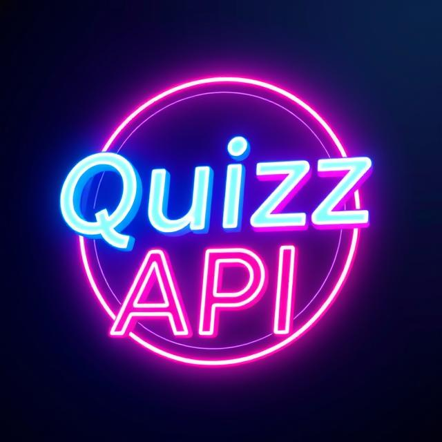

# TheQuizz API


## About
TheQuizz API is a knowledge quiz focusing on computer science as a proof of concept. In the future, the quiz can be expanded to cover other scientific topics, and possibly include riddles that can be solved individually. The goal is to create a fun and engaging quiz format that can be used in social settings, such as an activity for a cozy evening.

It is designed to be played using a single device (mobile/computer) for the quiz, not multiple.

Once the proof of concept is completed, more categories will be added.

## Base URL
The API can be accessed at: [quizzapi.sem2.dk/api](http://quizzapi.sem2.dk/api)
Routes: [quizzapi.sem2.dk/api/routes](http://quizzapi.sem2.dk/api/routes)

## Endpoints

### Game
| Method | Endpoint | Request Body | Response | Description |
|--------|---------|--------------|----------|-------------|
| `POST` | `/game/{number}` | `{}` | `201` | Creates a new game with a specified number of players. |
| `POST` | `/game/{gameid}/players/names` | `{ "player": "name" }` | `(e1)` | Adds players to a game. |
| `GET` | `/game/{gameid}/questions?limit={numberOfQuestions}&category={category}&difficulty={difficulty}` | | `{ "game": {...} }` | Retrieves questions based on category and difficulty level. |
| `POST` | `/api/game/{gameId}/player/{playerid}/question/{questionId}/answer` | `{ "answer": "Coding language" }` | `{ "correct": true, "pointsEarned": 10, "totalScore": 50 }` | The player submits an answer. |
| `GET` | `/api/game/{gameId}/score` | | `{ "player": {...} }` | Retrieves the score for an ongoing game. |

### Admin
| Method | Endpoint | Request Body | Response | Description |
|--------|---------|--------------|----------|-------------|
| `PUT` MISSING | `/api/admin/question` | `{ "question": "What does HTML stand for?", "rightAnswer": "HyperText Markup Language", "wrongAnswers": ["High Tech Modern Language", "Hyper Transfer Markup Language", "Home Tool Markup Language"], "category": "web development", "difficulty": "medium" }` | `{ "msg": "Question with id created successfully" }` | Creates a new question. |
| `PATCH` MISSING | `/api/admin/question/{questionId}` | `??` | `{ "msg": "Question updated successfully" }` | Updates a question. |
| `DELETE` MISSING | `/api/admin/question/{questionId}` | | `{ "msg": "Question is now gone" }` | Deletes a question. |

### Authentication
| Method | Endpoint | Request Body | Response | Description |
|--------|---------|--------------|----------|-------------|
| `POST` | `/auth/register` | `{ "username": "Jim", "password": "1234" }` | `200` | Registers a new user. |
| `POST` | `/auth/login` | `{ "username": "Jim", "password": "1234" }` | `200` | Logs in the user. |

## Error Handling
All errors are returned in the following format:
```json
{ "status": statusCode, "msg": "Description of the error" }
```
| Error Code | Description |
|----------|-------------|
| `400` | Invalid request (missing field, etc.). |
| `404` | Resource not found (game, question, etc.). |

## Request Body Examples
### Game Format
```json
{
  "players": {
    "players": [
      { "name": "Player1", "points": 0 },
      { "name": "Player2", "points": 0 }
    ]
  },
  "questions": {
    "results": [
      {
        "difficulty": "EASY",
        "category": "Science: Computers",
        "question": "The series of the Intel HD graphics generation succeeding that of the 5000 and 6000 series (Broadwell) is called:",
        "correct_answer": "HD Graphics 500",
        "incorrect_answers": ["HD Graphics 700", "HD Graphics 600", "HD Graphics 7000"]
      }
    ]
  }
}
```
### Player Format
```json
{
  "players": [
    { "name": "Player1", "points": 0 },
    { "name": "Player2", "points": 0 }
  ]
}
```

## Contact
If you have any questions or feedback, you can create an issue on [GitHub](https://github.com/mrPrimeBeef/TheQuizzAPI/issues).

The project retrieves quizzes from:

- [QuizAPI.io](https://quizapi.io/categories)
- [Open Trivia Database](https://opentdb.com/api_config.php)

